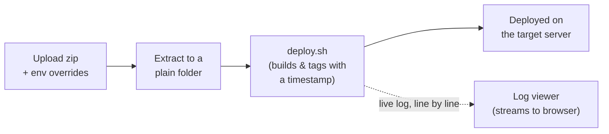

# Deploy Monitor — Overview

## What it is

A web app to deploy a project **by uploading a zip in the browser** —
no SSH, no terminal. Build, deploy, and live logs, all in the UI.

It's a front-end for an existing, already-proven deploy pipeline
(`deploy.sh` / `run.sh`), which is otherwise untouched — Deploy Monitor
just taught it one new trick: accept a plain folder directly, on top of
its original "SSH in and `git clone`" way of working.

## How it works

**One rule that matters:** success/failure is always read from the process
**exit code**, never guessed from log text.

## Highlights

- **Zip is extracted straight into a plain folder** — no git involved.
  Each image is tagged with a timestamp instead of a commit hash.
- **Runs as root**, so every user-supplied path is validated (zip entries,
  project names) and secret env values never touch a log or the database.
- **Single shared token** for auth, with a rate limiter that slows down
  guessing without ever locking out the real operator.
- **One deploy at a time** — a serial queue, no two builds racing each other.

## Stack

Next.js · TypeScript · SQLite · Server-Sent Events for live logs.
